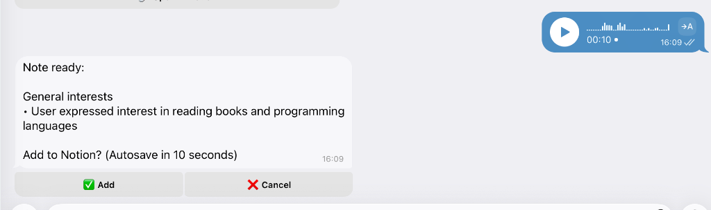
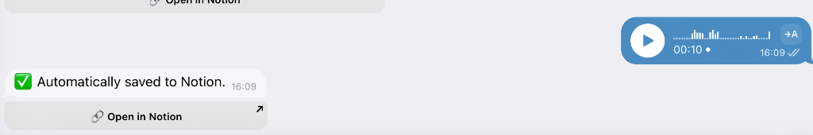
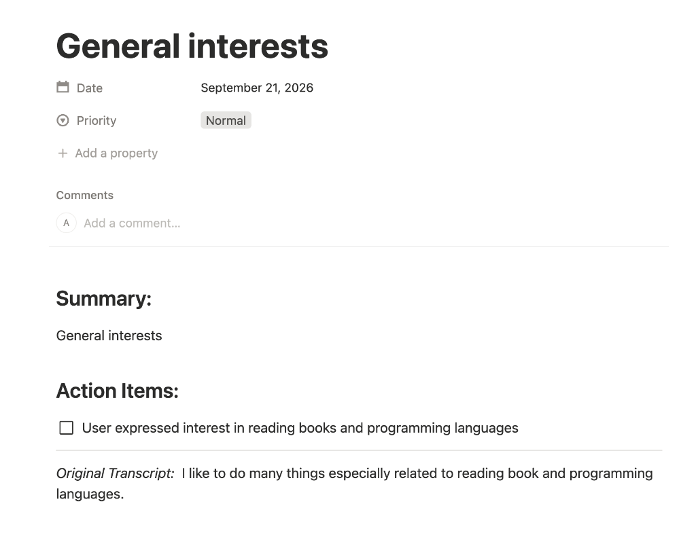

# Notion Voice Memo to Action Items

A Telegram bot that converts voice messages into structured Notion notes. It transcribes audio locally using [OpenAI Whisper](https://github.com/openai/whisper), extracts action items via [Google Gemini](https://ai.google.dev/), and publishes them to a Notion database — all through a conversational Telegram interface.

## How It Works

```
Voice Message → Whisper (local STT) → Gemini LLM (structuring) → Notion API (publishing)
```

1. User sends a voice message to the Telegram bot
2. Audio is downloaded and transcribed locally with Whisper (no external API calls for transcription)
3. The transcript is sent to Gemini to extract a title, tasks, date, and priority
4. The user sees a preview and can confirm or cancel
5. The structured note is published to their connected Notion database with to-do items

## Demo

| Voice Processing & Preview | Auto-save & Direct Notion Link | Structured Note in Notion |
| :---: | :---: | :---: |
|  |  |  |

## Features

- **Local speech-to-text** — Whisper runs on CPU/CUDA, no audio leaves the server
- **LLM-powered structuring** — Gemini extracts tasks, dates, and priorities from natural speech
- **Notion integration** — Creates pages with headings, to-do checkboxes, and the original transcript
- **Encrypted credential storage** — User Notion API keys are encrypted at rest with Fernet
- **Auto-save with confirmation** — Notes auto-save after 10 seconds, or the user can accept/cancel
- **Configurable Whisper model** — Choose model size via environment variable
- **Docker Compose deployment** — One-command setup with PostgreSQL and model caching

## Prerequisites

- [Docker](https://docs.docker.com/get-docker/) and [Docker Compose](https://docs.docker.com/compose/)
- A Telegram bot token — create one via [@BotFather](https://t.me/BotFather)
- A [Google Gemini API key](https://ai.google.dev/)
- A [Notion integration](https://developers.notion.com/docs/create-a-notion-integration) with a connected database

## Setup

1. **Clone the repository**

   ```bash
   git clone https://github.com/Artem817/Notion-Voice-Memo-to-Action-Items.git
   cd Notion-Voice-Memo-to-Action-Items
   ```

2. **Create a `.env` file** in the project root (see `.env.example`):

   ```env
   BOT_TOKEN=your_telegram_bot_token
   ADMIN_ID=your_telegram_user_id
   MASTER_KEY=your_fernet_key
   GEMINI_API_KEY=your_gemini_api_key
   POSTGRES_USER=notion_bot
   POSTGRES_PASSWORD=your_db_password
   POSTGRES_DB=notion_voice_memo
   ```

   Generate a Fernet key for `MASTER_KEY`:
   ```bash
   python -c "from cryptography.fernet import Fernet; print(Fernet.generate_key().decode())"
   ```

   Get your Telegram user ID by messaging [@userinfobot](https://t.me/userinfobot).

   **Optional variables:**

   | Variable | Default | Description |
   |---|---|---|
   | `WHISPER_MODEL` | `medium` | Whisper model size (`tiny`, `base`, `small`, `medium`, `large`) |
   | `WHISPER_DEVICE` | auto | Device for inference (`cpu`, `cuda`) |
   | `WHISPER_CACHE_DIR` | `./whisper_models` | Directory for cached model weights |
   | `WHISPER_PRELOAD` | `1` | Pre-load the model on startup (`1`/`0`) |

3. **Run with Docker Compose**

   ```bash
   docker compose up --build
   ```

### ⚡ For NVIDIA GPU (CUDA) Users
By default, the `Dockerfile` installs the **CPU-only** version of PyTorch to keep the image lightweight (~1.5GB) and the build time fast (2-3 mins). This is perfect for Mac (Apple Silicon) and standard Windows/Linux PCs.

If you have an NVIDIA GPU on a Linux host and want to use CUDA for faster transcription, simply replace the `RUN arch=...` block in the `Dockerfile` with `RUN pip install torch torchvision torchaudio` before running the build. This full build takes ~30 minutes as it downloads ~3GB of NVIDIA libraries.

   > [!TIP]
   > **First Startup & Model Download Time:**
   > On the first startup, Whisper automatically downloads the weights for your configured `WHISPER_MODEL`:
   > - **`tiny` (~75 MB)**: Downloads in seconds; ideal for quick testing or low-memory servers.
   > - **`base` (~140 MB)**: Very fast and lightweight.
   > - **`medium` (~1.5 GB)** (default): High transcription accuracy, but the initial download can take 5–20 minutes depending on network bandwidth.
   >
   > The weights are saved in the `./whisper_models` volume and persist across restarts, so they are only downloaded once.

4. **Connect Notion in Telegram**

   Send `/start` to the bot and follow the prompts to enter your Notion API key and database ID.

### 🤖 Bot Commands

| Command | Description |
|---|---|
| `/start` | Start the bot and initiate Notion workspace connection setup |
| `/help` | Send the setup guide (PDF) with step-by-step connection instructions |
| `/reset` | Disconnect the current Notion workspace and reset all stored credentials |

## Running without Docker

```bash
# Install dependencies (Python 3.12+ recommended)
pip install -r requirements.txt

# Ensure ffmpeg is installed
# macOS: brew install ffmpeg
# Ubuntu: sudo apt install ffmpeg

# Ensure PostgreSQL is running and DATABASE_URL is set in .env
# Note: The bot will automatically create database tables on startup.

# Start the bot
python -m app.main
```

## Project Structure

```
app/
  main.py                  # Bot entry point, Telegram handlers, Whisper loading
  voice_processing.py      # Pydantic model for voice processing requests
  speech_recogniser/
    speech_engine.py        # Whisper transcription logic
  services/
    llm_service.py          # Gemini LLM integration and structured output
    notion_publisher.py     # Notion API client (page creation, property management)
    notion_vault.py         # Fernet encryption for Notion API keys
    credential_manager.py   # Credential validation, encryption, and storage pipeline
  db/
    base.py                 # SQLAlchemy engine and session setup
    models.py               # NotionCredential model and FSM states
  alembic/                  # Database migration configuration
tests/
  unit/                     # Unit tests
```

## Development

```bash
pip install -r requirements-dev.txt
pytest tests/
```

## Known Limitations

- **Single User Mode**: The bot is currently restricted to the user specified in `ADMIN_ID`. Multi-user concurrency would require decoupling database sessions from Telegram async handlers and adding rate limits.
- **Audio Size**: Telegram restricts voice messages to ~20MB, but very long recordings can block Whisper threads. There is currently no duration check.
- **Synchronous Database Operations**: For simplicity, SQLAlchemy is run synchronously inside `aiogram` handlers. This works well for a personal bot but limits scale.

## License

[MIT](LICENSE)
